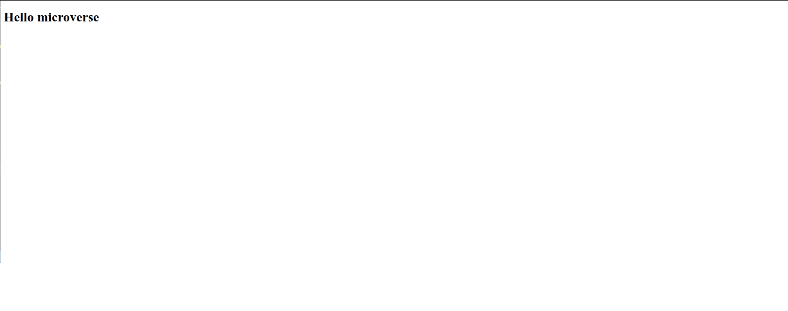

# Hello Microverse

> This project is meant to learn the best practise for creating a professional repository.

## Built With

- Html and css

## Live Demo

[Live Demo Link](https://jenadiusnicholaus.github.io/hello-microverse/)

## Prerequisites

- Html and css

## install

- In your terminal type.

> git clone https://github.com/jenadiusnicholaus/hello-microverse.git

- Then

> cd hellow-microverse

## Author

 {:height="20px" width="20px"} Jenadius Nicholaus

- GitHub: *[@jenadiusnicholaus](https://github.com/jenadiusnicholaus/)*.

- Twiter: *[@jenadius_kaim](https://twitter.com/jenadius_kaim)*.

- LinkedIn: *[@jenadiusnicholaus](https://www.linkedin.com/in/jenadius-nicholaus-73126819b/)*.

##    Contributing

 Contributions, issues, and feature requests are welcome!

## Show your support

 Give a star if you like this project!

## Acknowledgments

- Hat tip to anyone whose code was used
- Inspiration
- etc
